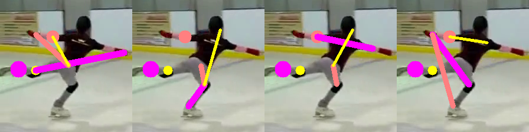
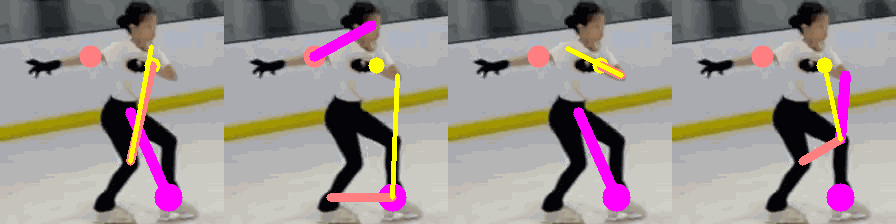

# Motion Attetnion Evaluation 
```                            
    __ ( }       __  __       _   _            __   __                _   
  '---. _`---,  |  \/  |     | | (_)           \ \ / /               | |  
  ___/ /        | \  / | ___ | |_ _  ___  _ __  \ V / _ __   ___ _ __| |_  
/,---'\\        | |\/| |/ _ \| __| |/ _ \| '_ \  > < | '_ \ / _ \ '__| __|
      //        | |  | | (_) | |_| | (_) | | | |/ . \| |_) |  __/ |  | |_ 
     '==        |_|  |_|\___/ \__|_|\___/|_| |_/_/ \_\ .__/ \___|_|   \__|
                                                      | |                  
                                                      |_|                   
```
This `Motion Attention Evaluation` aims to draw the attention matrix and attention nodes on human skeletal. 
* The goal of this attention matrix is to find some potential relationships between two joints which include adjacent joints and non-adjacent joints. In our case, we only show the top-3 important relationshop between joints.
* The meaning of the attention nodes can show the importance of top 3 nodes.
* Because we set 4 attention matrix on our training setting. There will only show 4 attention matrix.

### The value of the importance Top 3 
- top3 $\to$ top1 
-  $\to$  $\to$  `Attention Matrix` $M_0$ : Use Reverse COLORMAP_SPRING

-  $\to$   $\to$  `Attention Matrix` $M_1$ : Use COLORMAP_SUMMER

-  $\to$  $\to$  `Attention Matrix` $M_2$ : Use COLORMAP_COOL

-  $\to$  $\to$  `Attention Matrix` $M_3$ : Use Reverse COLORMAP_AUTUMN

ColorMap is referenced by `https://docs.opencv.org/4.x/d3/d50/group__imgproc__colormap.html`

## Visualize Attention Matrix and Attention Node on human skeleton



## Prepare
### Prepare the alphapose skeleton and the video
```shell
dir_path : '/home/{$USER}/datasets/Skating_Dataset
``` 
Take `Loop` for example, the directory path should be
```
- Skating_Dataset
    - alpha_pose_{$FILENAME}
        - vis 
            - 0.jpg
            - 1.jpg
                ...
        - {$FILENAME}.mp4
        - {$FILENAME}.npz
        - alphapose-results.json
    - alpha_pose_{$FILENAME}
        ...
```

### Prepare the config file 
```shell 
# finetune_nodiff_andrew
attention_node : '{$USER}/MotionExpert/results/finetune_nodiff_andrew/jsons/att_node_results_epoch90.json'
attention_matrix : '{$USER}/MotionExpert/results/finetune_nodiff_andrew/jsons/att_A_results_epoch90.json'
epoch_num : 90
output_dir : '{$USER}/Evaluation/finetuneAttention'
video_dir : '{$USER}/datasets/Skating_Dataset0811'
results_epoch : '{$USER}/MotionExpert/results/finetune_nodiff_andrew/jsons/results_epoch90.json'
```

## Run 
```shell
$ conda activate motion2text
$ python draw_skeleton2D.py /home/weihsin/projects/Evaluation/config_file/finetuneAttention.yaml 
```

## Implement Detailed
Originally, there are 22 joints on SMPL format. I map the SMPL format to OpenPose format that Alphapose use. 
* SMPL format

* OpenPose format

* Mapping SMPL $\to$ OpenPose


 mapping = [-1, 12, 15, -1, -1, 16, 17, 18, 19, 20, 21, 1, 2, 4, 5, 7, 8]
 ```
 SMPL format             Open Pose     Map     SMPL
  0 : pelvis              0 : Nose                  (None)
  1 : left-hip            1 : LEye             12 : neck 
  2 : right-hip           2 : REye             15 : head  
  3 : spine-1             3 : LEar                  (None)
  4 : left-knee           4 : REar                  (None)
  5 : right-knee          5 : LShoulder        16 : left-shoulder
  6 : spine-2             6 : RShoulder        17 : right-shoulder
  7 : left-ankle          7 : LElbow           18 : left-elbow
  8 : right-ankle         8 : RElbow           19 : right-elbow
  9 : spine-3             9 : LWrist           20 : left-wrist
 10 : left-foot          10 : RWrist           21 : right-wrist
 11 : right-foot         11 : LHip              1 : left-hip
 12 : neck               12 : RHip              2 : right-hip
 13 : left-collar        13 : LKnee             4 : left-knee 
 14 : right-collar       14 : Rknee             5 : right-knee   
 15 : head               15 : LAnkle            7 : left-ankle 
 16 : left-shoulder      16 : RAnkle            8 : right-ankle 
 17 : right-shoulder 
 18 : left-elbow
 19 : right-elbow
 20 : left-wrist
 21 : right-wrist
 ```
 OpenPose format is reference from `https://github.com/MVIG-SJTU/AlphaPose/blob/master/docs/output.md` 
